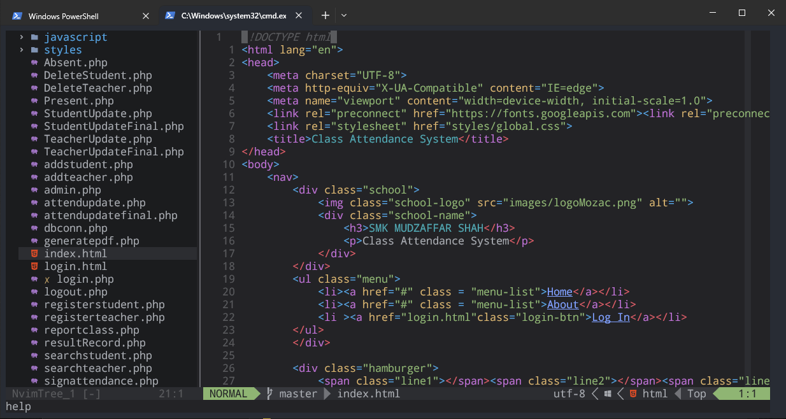

# My Neovim Configuration
This is my personal Neovim configuration, which I use for development work on a daily basis. The configuration is designed to be modular and extendable, and includes support for a variety of plugins and features to enhance productivity.

## Interfaces

## Features
- Tree-sitter: Provides advanced syntax highlighting and parsing for a variety of programming languages.
- Telescope: A fuzzy finder plugin that makes it easy to search and navigate files, buffers, and more.
- Harpoon: Provides easy navigation between project files and splits.
- Fugitive: Integrates Git commands and functionality directly into Neovim.
- Comment: Provides easy commenting and uncommenting of code.
- Lualine: A fast and customizable status line plugin.
- LSP: Provides language server protocol integration for code completion, highlighting, and more.
- Undotree: A visual undo history browser.
- One Dark theme: A color scheme that is easy on the eyes and works well for long coding sessions.

## Installation
To use this Neovim configuration, you will need to install Neovim, as well as some additional dependencies. Here are the steps you can follow to get started:

1. Install Neovim: You can download the latest release of Neovim from the official website.
2. Install the plugins: You can use a package manager like Plug or Packer to manage your plugins. Simply copy the contents of my init.lua file to your own init.lua file and run :PlugInstall or :PackerInstall.
3. Install the required dependencies: Some plugins require additional dependencies to work properly. Check the documentation of each plugin to see if any additional dependencies are required.
4. Usage
5. Once you have installed the configuration and the required dependencies, you can start using Neovim with all the features and plugins. Here are some of the key bindings and commands that you can use:

- <leader>ff: Use Telescope to search for files.
- <leader>fh: Use Telescope to search for help topics.
- <leader>gb: Open the Git blame for the current file.
- <leader>gs: Open the Git status window.
- <leader>gc: Use Fugitive to commit changes to the current file.
- <leader>c<space>: Toggle the comment for the current line or visual selection.
- <leader>u: Open the undo tree browser.
- <leader>hjkl: Use Harpoon to navigate between files and splits.
- <leader>e: Use Telescope to open the Neovim configuration directory.
- <leader>q: Quit the current window or buffer.

## Customization
This configuration is designed to be highly customizable, and you can easily add or remove plugins and features to suit your needs. The configuration is organized into modular Lua files, making it easy to add or remove functionality without affecting the rest of the configuration. You can also modify the key bindings and commands to suit your workflow by editing the init.lua file.
